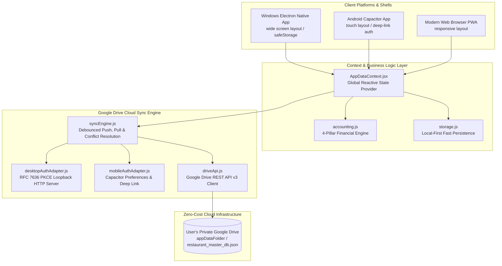
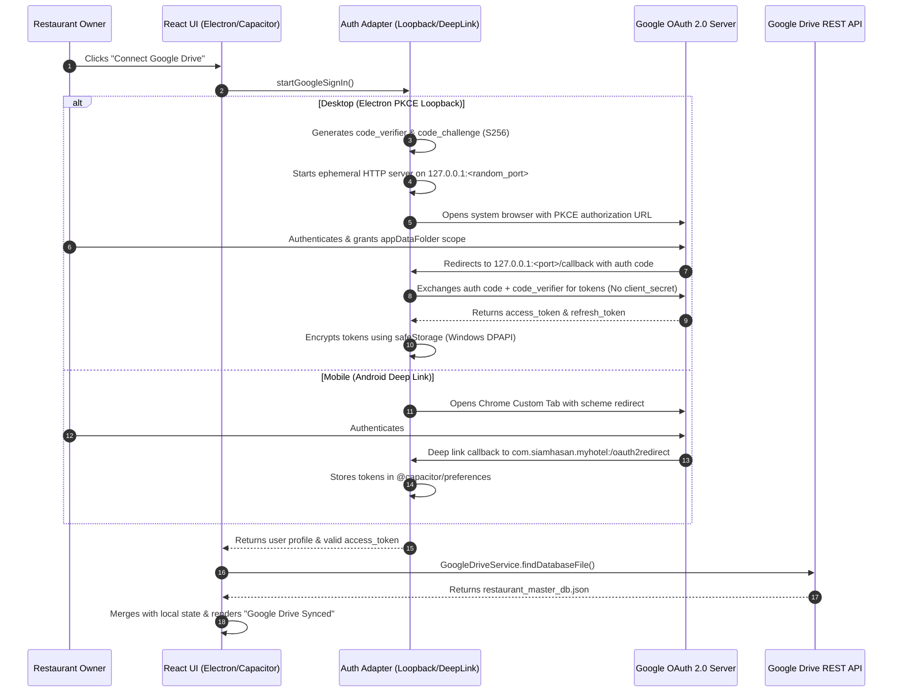
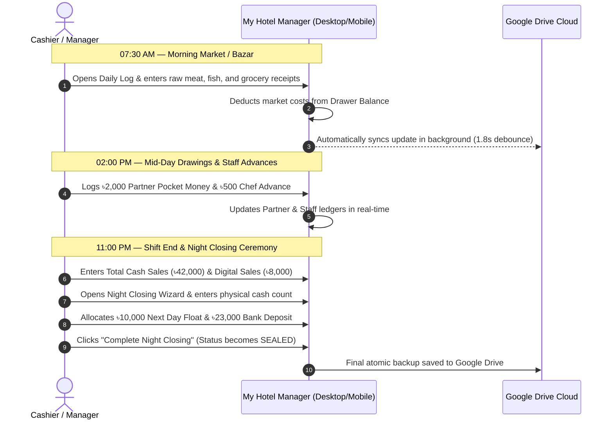

# 🏨 My Hotel & Restaurant Manager — Ultimate Enterprise Technical & Operational Manual

---

## 📑 Comprehensive Table of Contents

1. [Executive Summary & Problem Statement](#1-executive-summary--problem-statement)
2. [High-Level System Architecture](#2-high-level-system-architecture)
3. [Exhaustive Page-by-Page & Screen-by-Screen Breakdown](#3-exhaustive-page-by-page--screen-by-screen-breakdown)
   - [3.1 Executive Dashboard Screen](#31-executive-dashboard-screen)
   - [3.2 Daily Bazar & Sales Ledger Screen](#32-daily-bazar--sales-ledger-screen)
   - [3.3 Family Partners & Staff Screen](#33-family-partners--staff-screen)
   - [3.4 Fixed CapEx Assets & Monthly Bills Screen](#34-fixed-capex-assets--monthly-bills-screen)
   - [3.5 Cloud & Gmail Sync Screen](#35-cloud--gmail-sync-screen)
   - [3.6 Global App Shell, Sidebar, Header & Quick Actions](#36-global-app-shell-sidebar-header--quick-actions)
4. [Master JSON Database Schema & Data Models](#4-master-json-database-schema--data-models)
5. [Accounting Engine & 4-Pillar Financial Logic](#5-accounting-engine--4-pillar-financial-logic)
   - [5.1 Mathematical Formulas & Reconciliation Rules](#51-mathematical-formulas--reconciliation-rules)
   - [5.2 Step-by-Step Daily Accounting Example (With Concrete Numbers)](#52-step-by-step-daily-accounting-example-with-concrete-numbers)
   - [5.3 Multi-Period Aggregations & Lifetime Capital ROI](#53-multi-period-aggregations--lifetime-capital-roi)
6. [Google Drive Cloud Sync & Multi-Device Synchronization Engine](#6-google-drive-cloud-sync--multi-device-synchronization-engine)
   - [6.1 The "Google Drive as a Zero-Cost DB" Paradigm](#61-the-google-drive-as-a-zero-cost-db-paradigm)
   - [6.2 Platform Authentication Architecture (Desktop PKCE vs Mobile Native)](#62-platform-authentication-architecture-desktop-pkce-vs-mobile-native)
   - [6.3 Debounced Push, Pull & Conflict Resolution Engine](#63-debounced-push-pull--conflict-resolution-engine)
   - [6.4 Failure Mode Handling & State Machine](#64-failure-mode-handling--state-machine)
7. [Complete Codebase File-by-File Technical Directory Map](#7-complete-codebase-file-by-file-technical-directory-map)
8. [Daily Cashier & Manager Operational Workflow](#8-daily-cashier--manager-operational-workflow)
9. [Build, Packaging & Release Engineering](#9-build-packaging--release-engineering)
10. [Google Cloud Console & OAuth Configuration Manual](#10-google-cloud-console--oauth-configuration-manual)

---

## 1. Executive Summary & Problem Statement

Running a hotel or restaurant business in Bangladesh and South Asia entails unique operational dynamics that standard enterprise accounting packages (such as QuickBooks, Tally, or Excel spreadsheets) fail to solve:

1. **Morning Raw Market Volatility (কাঁচা বাজার):** Kitchen staff or partners purchase raw meat, fish, spices, and vegetables early every morning with physical counter cash.
2. **Multiple Family Partners Taking Cash (পকেট খরচ / Drawings):** In family businesses, partners withdraw variable pocket money from the drawer at various points of the day.
3. **Daily Staff Salary Advances (দৈনিক খোরাকি / অ্যাডভান্স):** Chefs and service staff request daily ৳500–৳1000 advances against their monthly salary.
4. **Counter Cash Drawer Reconciliation:** At the end of a shift, cashiers struggle to prove whether physical cash matches expected gross sales minus morning expenses and withdrawals.
5. **Prohibitive Cloud Server Costs:** Small-to-medium restaurants cannot afford recurring monthly database subscriptions ($20–$50/mo for Supabase, MongoDB Atlas, AWS RDS).

**My Hotel & Restaurant Manager** solves all of these challenges through a **Zero-Cost, Local-First, Google-Drive-Backed, Cross-Platform Architecture**. The entire state is stored in a single JSON file inside the user's private Google Drive application folder, providing instant synchronization across desktop POS counters and managers' Android smartphones.

---

## 2. High-Level System Architecture



---

## 3. Exhaustive Page-by-Page & Screen-by-Screen Breakdown

The application features 5 dedicated primary screens along with universal navigation, header telemetry, and modal drawers.

---

### 3.1 Executive Dashboard Screen
* **Files:** [`src/desktop/screens/DesktopDashboardScreen.jsx`](file:///c:/Users/siamhasan/Desktop/My%20Hotel/src/desktop/screens/DesktopDashboardScreen.jsx), [`src/mobile/screens/DashboardScreen.jsx`](file:///c:/Users/siamhasan/Desktop/My%20Hotel/src/mobile/screens/DashboardScreen.jsx)
* **Target Users:** General Managers, Managing Partners, Business Owners.
* **Purpose:** Provides a 360-degree high-level financial overview across any selectable timeframe.

```
┌─────────────────────────────────────────────────────────────────────────────┐
│                       EXECUTIVE DASHBOARD LAYOUT                            │
├─────────────────────────────────────────────────────────────────────────────┤
│ [Daily View] [Weekly Summary] [Monthly Report] [Yearly] [All-Time Lifetime] │
├─────────────────────────────────────────────────────────────────────────────┤
│ ┌────────────────┐ ┌────────────────┐ ┌────────────────┐ ┌────────────────┐ │
│ │  TOTAL SALES   │ │ MORNING BAZAR  │ │POCKET+ADVANCES │ │  DRAWER CASH   │ │
│ │    ৳ 45,000    │ │    ৳ 14,500    │ │    ৳ 3,500     │ │    ৳ 37,000    │ │
│ └────────────────┘ └────────────────┘ └────────────────┘ └────────────────┘ │
├─────────────────────────────────────────────────────────────────────────────┤
│ 📈 Yesterday vs Today: +18.4% growth in gross revenues                      │
│ 🎯 Lifetime Capital Breakeven: [████████████░░░░] 68% ROI Recovered         │
│ 💵 Operating Profit: ৳ 30,200  │ Net Cash Balance Remaining: ৳ 26,700       │
└─────────────────────────────────────────────────────────────────────────────┘
```

#### Detailed Element & Feature Breakdown:
1. **Period Selection Tabs:**
   - **`Daily View`:** Reflects the currently active calendar date selected in the global header.
   - **`Weekly Summary`:** Aggregates rolling 7 days from the selected date.
   - **`Monthly Report`:** Calculates totals for the selected calendar month (e.g. `2026-08`).
   - **`Yearly Financials`:** Aggregates full 12 months for tax and shareholder review.
   - **`All-Time Lifetime`:** Computes cumulative lifetime earnings, total market expense, partner drawings, and CapEx assets since establishment.
2. **Top 4 Financial Pillar KPI Cards:**
   - **Gross Total Sales:** Cash Sales + Digital/bKash/Card sales.
   - **Morning Market Cost (COGS):** Total expenditure on raw kitchen supplies.
   - **Pocket Money & Advances:** Combined cash outlays to owners and staff.
   - **Drawer Cash (In-Hand):** Current expected physical cash in the cashier box.
3. **Yesterday Comparison Badge:**
   - Compares today's total sales against yesterday's record. Displays green trending pill (e.g., `+15.2% vs yesterday`) or amber pill if sales dropped.
4. **Capital ROI & Breakeven Progress Bar:**
   - Computes: `(Cumulative Lifetime Profit / Total Capital Investment) * 100`.
   - Visualizes breakeven status with high-contrast emerald green gradient. Shows remaining capital to be recovered.
5. **Operating Profit vs Net Cash Split:**
   - Explains the critical difference between *accounting operating profit* (Sales minus Food Costs minus Wastage) and *physical net cash remaining* after pocket money withdrawals.

---

### 3.2 Daily Bazar & Sales Ledger Screen
* **Files:** [`src/desktop/screens/DesktopDailyLogScreen.jsx`](file:///c:/Users/siamhasan/Desktop/My%20Hotel/src/desktop/screens/DesktopDailyLogScreen.jsx), [`src/mobile/screens/DailyLogScreen.jsx`](file:///c:/Users/siamhasan/Desktop/My%20Hotel/src/mobile/screens/DailyLogScreen.jsx)
* **Target Users:** Counter Cashier, Head Chef, Shift Manager.
* **Purpose:** Core daily ledger for logging morning market receipts, hourly food sales, and conducting the structured Night Closing ceremony.

```
┌─────────────────────────────────────────────────────────────────────────────┐
│                    DAILY BAZAR & SALES LEDGER LAYOUT                        │
├─────────────────────────────────────────────────────────────────────────────┤
│ 📅 Date Selector: [◀]  August 28, 2026 (Today)  [▶]   [Sealed / Active Badge]│
├──────────────────────────────────────┬──────────────────────────────────────┤
│ 1. MORNING BAZAR / MARKET (COGS)     │ 2. DAILY SALES & COLLECTIONS         │
│ • Beef & Mutton: ৳ 8,500 [Drawer]    │ • Cash Sales: ৳ 38,000               │
│ • Fresh Vegetables: ৳ 2,100 [Drawer] │ • Digital / Card / bKash: ৳ 7,000    │
│ • Spices & Cooking Oil: ৳ 3,200 [Own]│ • Gross Total: ৳ 45,000              │
│ [+ Add Bazar Item Button]            │                                      │
├──────────────────────────────────────┴──────────────────────────────────────┤
│ 3. CASH BOX RECONCILIATION & NIGHT CLOSING CEREMONY                         │
│ • Expected Drawer Cash: ৳ 37,400                                            │
│ • Physical Cash Count:  ৳ 37,400 (Perfect Match - ৳0 Discrepancy)           │
│ • Allocation: ৳10,000 Next Day Float │ ৳25,000 Bank Deposit │ ৳2,400 Vault  │
│ [🔒 Complete Night Closing Button]                                          │
└─────────────────────────────────────────────────────────────────────────────┘
```

#### Detailed Section Breakdown:
1. **Section 1: Morning Bazar Management:**
   - **Item Name:** e.g., Chicken, Mustard Oil, Basmati Rice.
   - **Amount (৳):** Exact cost in BDT.
   - **Category Tag:** `MEAT_FISH` (Red), `GROCERY` (Emerald), `VEGETABLES` (Green), `GAS_FUEL` (Orange), `SPICES` (Purple), `DAIRY` (Cyan).
   - **Buyer (ক্রেতা):** Selects which partner or staff member went to the bazaar.
   - **Paid From (টাকার উৎস):**
     - `CASH_DRAWER`: Deducts directly from today's drawer cash balance.
     - `OWNER_POCKET`: Leaves drawer cash untouched; recorded as an owner credit.
2. **Section 2: Daily Sales Entry:**
   - Real-time gross sales recording.
   - Instant calculation of Cash vs Digital split.
3. **Section 3: Drawer Reconciliation Engine:**
   - Dynamically calculates: `Opening Float + Cash Sales - Drawer Bazar - Pocket Drawings - Staff Advances`.
4. **Section 4: Night Closing Wizard Modal:**
   - **Step 1: Physical Cash Count:** Cashier enters physical cash counted in notes and coins.
   - **Step 2: Discrepancy Calculation:** If physical cash differs from expected cash, surfaces an alert (Surplus vs Shortage).
   - **Step 3: Distribution Planning:**
     - `Next Day Opening Float`: Money reserved in the cash box for tomorrow's opening (automatically carries over to the next day's opening float).
     - `Bank Deposit`: Cash sent to bank or mobile agent deposit.
     - `Bank Deposit Reference / Note`: Bank slip number or branch name.
     - `Retained Vault Reserve`: Remaining cash kept in safe locker.
   - **Step 4: Sign-off:** Managing Partner digital sign-off and optional operational notes.
   - Upon submission, marks the day as **`SEALED`**.

---

### 3.3 Family Partners & Staff Screen
* **Files:** [`src/desktop/screens/DesktopFamilyStaffScreen.jsx`](file:///c:/Users/siamhasan/Desktop/My%20Hotel/src/desktop/screens/DesktopFamilyStaffScreen.jsx), [`src/mobile/screens/FamilyStaffScreen.jsx`](file:///c:/Users/siamhasan/Desktop/My%20Hotel/src/mobile/screens/FamilyStaffScreen.jsx)
* **Target Users:** Managing Partners, HR, Payroll Cashier.
* **Purpose:** Total transparency over partner pocket money drawings and staff salary advance settlements.

```
┌─────────────────────────────────────────────────────────────────────────────┐
│                    PARTNERS & STAFF MANAGEMENT LAYOUT                       │
├──────────────────────────────────────┬──────────────────────────────────────┤
│ 👑 MANAGING PARTNERS (OWNERS)        │ 👨‍🍳 RESTAURANT STAFF (EMPLOYEES)     │
├──────────────────────────────────────┼──────────────────────────────────────┤
│ • Partner 1 (Managing Partner)       │ • Head Chef (Salary: ৳25,000/mo)     │
│   - Monthly Withdrawals: ৳ 18,000    │   - Advances Taken This Mo: ৳ 4,500  │
│   - Total All-Time: ৳ 145,000        │   - Net Payable Salary: ৳ 20,500     │
│                                      │                                      │
│ • Partner 2 (Operations Partner)     │ • Senior Waiter (Salary: ৳15,000/mo) │
│   - Monthly Withdrawals: ৳ 12,000    │   - Advances Taken This Mo: ৳ 2,000  │
│   - Total All-Time: ৳ 84,000         │   - Net Payable Salary: ৳ 13,000     │
│                                      │                                      │
│ [+ Add New Partner]                  │ [+ Register New Employee]            │
│ [💸 Log Partner Pocket Money]        │ [💵 Log Daily Staff Advance]         │
└──────────────────────────────────────┴──────────────────────────────────────┘
```

#### Detailed Feature Breakdown:
1. **Partner Management Subsystem:**
   - Create and edit partner profiles with custom color-coded avatars.
   - **Log Pocket Money Modal:** Date, Partner, Amount, and Purpose (e.g. Family Grocery, Children Tuition, Personal Expense).
   - Instant timeline of every withdrawal with date, time, and cumulative totals.
2. **Staff Payroll & Advance Subsystem:**
   - Register staff with Designation, Base Monthly Salary (৳), Phone, and Join Date.
   - **Log Daily Advance Modal:** Date, Staff Member, Amount, and Reason.
   - **Automatic Salary Ledger:**
     $$\text{Net Salary Payable at Month-End} = \text{Fixed Base Salary} - \sum (\text{Advances Taken in Month})$$

---

### 3.4 Fixed CapEx Assets & Monthly Bills Screen
* **Files:** [`src/desktop/screens/DesktopExpensesScreen.jsx`](file:///c:/Users/siamhasan/Desktop/My%20Hotel/src/desktop/screens/DesktopExpensesScreen.jsx), [`src/mobile/screens/ExpensesScreen.jsx`](file:///c:/Users/siamhasan/Desktop/My%20Hotel/src/mobile/screens/ExpensesScreen.jsx)
* **Target Users:** Business Owners, Accountants.
* **Purpose:** Tracks long-term capital assets (CapEx), recurring monthly operational utilities (OpEx), and kitchen wastage.

#### Tabbed Segments:
1. **Fixed Assets (CapEx):**
   - Tracks commercial kitchen refrigerators, deep fryers, AC units, furniture, and interior decor.
   - Category filtering: `FURNITURE`, `EQUIPMENT`, `INTERIOR`, `ELECTRONICS`, `VEHICLE`.
   - Summed automatically into the business's **Total Capital Investment Base**.
2. **Monthly Bills & Utilities (OpEx):**
   - Tracks Shop Floor Rent, DESCO Electricity Bill, Titas Gas/Cylinder, WASA Water, High-Speed Internet, Waste Management.
   - One-click **`Mark as Paid` / `Mark as Unpaid`** toggle button.
   - Unpaid bills are highlighted in amber/red badges and subtracted from retained profit.
3. **Wastage & Demurrage (কিচেন অপচয়):**
   - Records spoiled food batches, burned raw materials, or broken crockery.
   - Deducted directly from daily operating profit.

---

### 3.5 Cloud & Gmail Sync Screen
* **Files:** [`src/desktop/screens/DesktopCloudSettingsScreen.jsx`](file:///c:/Users/siamhasan/Desktop/My%20Hotel/src/desktop/screens/DesktopCloudSettingsScreen.jsx), [`src/mobile/screens/CloudSettingsScreen.jsx`](file:///c:/Users/siamhasan/Desktop/My%20Hotel/src/mobile/screens/CloudSettingsScreen.jsx)
* **Target Users:** System Administrator, Master Owner.
* **Purpose:** Manages Google OAuth 2.0 authentication, live Drive sync telemetry, JSON database exports, and backups.

```
┌─────────────────────────────────────────────────────────────────────────────┐
│                     CLOUD & GMAIL SYNC SETTINGS                             │
├─────────────────────────────────────────────────────────────────────────────┤
│ ☁️ GOOGLE DRIVE CLOUD DATABASE ENGINE                                       │
│ • Account Status: Connected as restaurant.owner@gmail.com                   │
│ • Target Drive Scope: Private Hidden appDataFolder (Safe & Isolated)        │
│ • Last Cloud Sync: Today at 09:45:22 PM (Status: Synced)                    │
│                                                                             │
│ [ 🔄 Sync Now (Push & Pull) ]          [ 🚪 Disconnect Google Account ]     │
├─────────────────────────────────────────────────────────────────────────────┤
│ 💾 LOCAL DATABASE BACKUP & RESTORE TOOLS                                    │
│ • [ ⬇️ Download JSON Backup ]  - Export master database to PC storage       │
│ • [ ⬆️ Restore JSON Backup ]   - Import database file from another machine  │
│ • [ ⚠️ Factory Reset Database ] - Clear all data to fresh zero baseline     │
└─────────────────────────────────────────────────────────────────────────────┘
```

#### Detailed Functionality:
1. **Google Drive Integration Module:**
   - Displays real-time connection status with Google Account Email.
   - `Connect Google Drive` button with live loading spinner (`isSigningIn`).
   - `Disconnect` button: Performs a clean logout, destroying local encrypted tokens and resetting sync status to `UNAUTHENTICATED`.
2. **Sync Telemetry & Action Buttons:**
   - **`Sync Now`:** Triggers an immediate bidirectional sync (pulls latest changes from Drive and pushes pending local edits).
3. **Data Portability & Emergency Backup:**
   - **Download Backup:** Exports entire database as an indented `.json` file (`restaurant_master_backup_YYYY-MM-DD.json`).
   - **Restore Backup:** Validates JSON schema integrity and imports database records.
   - **Factory Reset:** Clears local database with double-confirmation modal.

---

### 3.6 Global App Shell, Sidebar, Header & Quick Actions
* **Files:** [`src/desktop/components/DesktopHeader.jsx`](file:///c:/Users/siamhasan/Desktop/My%20Hotel/src/desktop/components/DesktopHeader.jsx), [`src/desktop/components/DesktopSidebar.jsx`](file:///c:/Users/siamhasan/Desktop/My%20Hotel/src/desktop/components/DesktopSidebar.jsx), [`src/mobile/components/Header.jsx`](file:///c:/Users/siamhasan/Desktop/My%20Hotel/src/mobile/components/Header.jsx), [`src/mobile/components/BottomNav.jsx`](file:///c:/Users/siamhasan/Desktop/My%20Hotel/src/mobile/components/BottomNav.jsx)

1. **Desktop Header:**
   - Shows active date with quick backward/forward date stepper and "Today" button.
   - Displays real-time dynamic Google Drive Sync pill badge:
     - 🟢 **Google Drive Synced** (Up to date)
     - 🔵 **Synchronizing...** (Sync in progress)
     - 🟡 **Offline Mode** (No internet connection)
     - ⚪ **Click to Connect** (Unauthenticated)
2. **Desktop Sidebar:**
   - Brand logo with hotel name and 5-star management badge.
   - Navigation menu with dynamic count badges (e.g. `2P • 6S` for 2 Partners & 6 Staff).
   - **4 Quick Desk Entry Buttons:**
     - `+ Bazar`: Instant morning market popup.
     - `+ Sales`: Instant cash/digital sales popup.
     - `+ Pocket`: Instant partner drawing popup.
     - `+ Advance`: Instant staff salary advance popup.
   - **Live Cash Drawer Widget:** Displays current in-hand cash and shift status (Active vs Sealed).
3. **Mobile Header & Bottom Navigation:**
   - Compact sticky top bar with swipeable date stepper.
   - Bottom navigation bar with 5 intuitive touch tabs (Dashboard, Daily Log, Staff, Bills, Cloud).

---

## 4. Master JSON Database Schema & Data Models

The entire application runs on a clean, single-document JSON schema (`restaurant_master_db.json`).

```json
{
  "updatedAt": "2026-08-28T15:45:00.000Z",
  "restaurant_info": {
    "name": "My Hotel & Restaurant",
    "currency": "৳",
    "initial_capital_investment": 500000,
    "created_at": "2026-08-01",
    "google_drive_connected": true,
    "google_account_email": "restaurant.owner@gmail.com",
    "google_client_id": "545241831805-xxx.apps.googleusercontent.com",
    "google_api_key": "",
    "last_synced_at": "2026-08-28T15:45:00.000Z"
  },
  "owners": [
    {
      "id": "owner_1724851200000",
      "name": "Managing Partner Name",
      "role": "Managing Partner",
      "phone": "+880 1711-000000",
      "color": "#059669"
    }
  ],
  "staff": [
    {
      "id": "staff_1724851300000",
      "name": "Head Chef Name",
      "role": "Head Chef",
      "base_salary": 25000,
      "phone": "01700-000000",
      "joining_date": "2026-08-01"
    }
  ],
  "fixed_assets": [
    {
      "id": "asset_1724851400000",
      "item_name": "Commercial Kitchen Refrigerator",
      "amount": 85000,
      "category": "EQUIPMENT",
      "date": "2026-08-01"
    }
  ],
  "monthly_bills": [
    {
      "id": "bill_1724851500000",
      "type": "Shop Floor Rent",
      "amount": 40000,
      "month": "2026-08",
      "is_paid": true,
      "paid_date": "2026-08-05"
    }
  ],
  "daily_records": [
    {
      "date": "2026-08-28",
      "opening_float": 10000,
      "morning_market": [
        {
          "id": "bazar_1",
          "item_name": "Beef & Mutton (15kg)",
          "amount": 11500,
          "category": "MEAT_FISH",
          "paid_from": "CASH_DRAWER",
          "buyer": "Managing Partner Name"
        },
        {
          "id": "bazar_2",
          "item_name": "Fresh Vegetables & Herbs",
          "amount": 2500,
          "category": "VEGETABLES",
          "paid_from": "CASH_DRAWER",
          "buyer": "Head Chef Name"
        }
      ],
      "sales": {
        "cash_sales": 42000,
        "digital_sales": 8000
      },
      "owner_drawings": [
        {
          "id": "draw_1",
          "owner_id": "owner_1724851200000",
          "owner_name": "Managing Partner Name",
          "amount": 2000,
          "purpose": "Personal Household Expense"
        }
      ],
      "staff_advances": [
        {
          "id": "adv_1",
          "staff_id": "staff_1724851300000",
          "staff_name": "Head Chef Name",
          "amount": 500,
          "notes": "Daily Grocery Advance"
        }
      ],
      "wastage_demurrage": [
        {
          "id": "waste_1",
          "description": "Kitchen Crockery Breakage",
          "amount": 350,
          "reason": "Accidental Breakage"
        }
      ],
      "night_closing": {
        "completed": true,
        "actual_drawer_cash": 35500,
        "next_day_opening_float": 10000,
        "bank_deposit": 23000,
        "bank_note": "City Bank Cash Deposit",
        "retained_vault_reserve": 2500,
        "closed_by": "Managing Partner Name",
        "notes": "Excellent evening sales.",
        "closed_at": "2026-08-28T17:00:00.000Z"
      }
    }
  ]
}
```

---

## 5. Accounting Engine & 4-Pillar Financial Logic

All financial computations are isolated within [`src/utils/accounting.js`](file:///c:/Users/siamhasan/Desktop/My%20Hotel/src/utils/accounting.js).

### 5.1 Mathematical Formulas & Reconciliation Rules

```
Expected Cash in Drawer = Opening Float
                        + Cash Sales
                        - (Morning Bazar Paid from Drawer Cash)
                        - Total Owner Pocket Money Drawings
                        - Total Staff Daily Advances
```

* **Gross Total Sales:**
  $$\text{Total Sales} = \text{Cash Sales} + \text{Digital Sales}$$
* **Daily Operating Profit (পরিচালন মুনাফা):**
  $$\text{Operating Profit} = \text{Total Sales} - \text{Total Morning Bazar} - \text{Total Wastage}$$
* **Net Cash Remaining (অবশিষ্ট নিট ক্যাশ):**
  $$\text{Net Cash Remaining} = \text{Operating Profit} - \text{Owner Pocket Money} - \text{Staff Advances}$$
* **Cash Drawer Discrepancy (ক্যাশ গরমিল):**
  $$\text{Surplus / Shortage} = \text{Actual Physical Cash Count} - \text{Expected Drawer Cash}$$

---

### 5.2 Step-by-Step Daily Accounting Example (With Concrete Numbers)

Let us walk through a complete real-world operating day:

| Transaction Event | Flow Type | Amount (৳) | Cash Drawer Impact | Running Drawer Balance |
| :--- | :--- | :--- | :--- | :--- |
| **08:00 AM:** Opening Float carried from yesterday | Opening Float | + ৳ 10,000 | + ৳ 10,000 | **৳ 10,000** |
| **08:30 AM:** Morning Bazar (Meat & Fish) | Kitchen Expense | - ৳ 11,500 | - ৳ 11,500 | **- ৳ 1,500** *(Temporary)* |
| **09:00 AM:** Morning Bazar (Vegetables) | Kitchen Expense | - ৳ 2,500 | - ৳ 2,500 | **- ৳ 4,000** |
| **02:00 PM:** Lunch Rush Cash Sales | Counter Inflow | + ৳ 22,000 | + ৳ 22,000 | **+ ৳ 18,000** |
| **03:00 PM:** Partner takes pocket money | Owner Drawing | - ৳ 2,000 | - ৳ 2,000 | **+ ৳ 16,000** |
| **04:00 PM:** Head Chef takes daily advance | Staff Advance | - ৳ 500 | - ৳ 500 | **+ ৳ 15,500** |
| **10:30 PM:** Evening Dinner Cash Sales | Counter Inflow | + ৳ 20,000 | + ৳ 20,000 | **+ ৳ 35,500** |
| **10:45 PM:** Digital / bKash Sales (into bank) | Digital Inflow | + ৳ 8,000 | ৳ 0 *(Direct to bank)* | **৳ 35,500** |

#### Night Closing Reconciliation:
- **Expected Drawer Cash:** `10,000 + 42,000 - 14,000 - 2,000 - 500 = ৳ 35,500`.
- **Physical Cash Counted:** Cashier counts physical notes and enters `৳ 35,500` (Discrepancy: `৳ 0`).
- **Night Closing Cash Split:**
  - `Next Day Opening Float`: ৳ 10,000 (kept in drawer for tomorrow).
  - `Bank Deposit`: ৳ 23,000 (handed to owner / bank deposit).
  - `Retained Vault Reserve`: ৳ 2,500 (locked in office safe).
  - `Total Distributed`: `10,000 + 23,000 + 2,500 = ৳ 35,500` *(100% Balanced)*.

#### Daily Performance Summary:
- **Gross Revenue:** ৳ 50,000 (৳42,000 Cash + ৳8,000 Digital)
- **Cost of Goods Sold (Bazar):** ৳ 14,000
- **Daily Wastage:** ৳ 350
- **Daily Operating Profit:** `50,000 - 14,000 - 350 = ৳ 35,650`
- **Net Cash Retained:** `35,650 - 2,000 (Drawing) - 500 (Advance) = ৳ 33,150`

---

### 5.3 Multi-Period Aggregations & Lifetime Capital ROI

The accounting engine dynamically rolls daily records into period summaries:
* **Monthly Revenue:** $\sum \text{Daily Sales for the Month}$.
* **Monthly Gross Profit:** $\sum \text{Daily Operating Profit} - \sum \text{Paid Monthly Bills}$.
* **Capital Investment Base:** $\text{Initial Investment} + \sum \text{Fixed CapEx Assets}$.
* **Cumulative Retained Earnings:** All-time operating profits minus all partner drawings minus all monthly bills.
* **Breakeven Progress (%):**
  $$\text{Breakeven \%} = \min\left(100, \left(\frac{\text{Cumulative Retained Earnings}}{\text{Capital Investment Base}}\right) \times 100\right)$$

---

## 6. Google Drive Cloud Sync & Multi-Device Synchronization Engine

The sync subsystem is located in `src/sync/` and guarantees reliable data replication across devices without dedicated backend servers.

### 6.1 The "Google Drive as a Zero-Cost DB" Paradigm
* **Isolated `appDataFolder` Scope:** The database JSON file is stored inside Google Drive's hidden `appDataFolder`. It cannot be viewed or accidentally deleted in Google Drive's web interface.
* **Full Data Ownership:** Only the restaurant owner's Google account holds the encryption tokens and database file.

### 6.2 Platform Authentication Architecture



### 6.3 Debounced Push, Pull & Conflict Resolution Engine
* **1.8-Second Debounced Auto-Push:** When cashiers enter data rapidly, the engine buffers changes and triggers an atomic multipart PATCH upload only after 1.8 seconds of inactivity.
* **Startup Pull with Conflict Resolution:**
  - Compares local `updatedAt` with remote `updatedAt`.
  - If remote is newer, updates local state.
  - If local is newer, pushes local state to remote.
* **Corrupted JSON Guard:** `GoogleDriveService.downloadDatabase` parses and validates schema integrity before committing to memory. If remote JSON is corrupted, local state is preserved and an error badge is displayed.

### 6.4 Failure Mode Handling & State Machine

| Scenario | State Triggered | System Behavior |
| :--- | :--- | :--- |
| **Internet Disconnected** | `SYNC_STATUS.OFFLINE` | Disables network calls; queues changes locally; yellow header badge. |
| **Internet Reconnected** | `SYNC_STATUS.SYNCING` | Auto-detects `window.ononline`; flushes queued edits to Drive. |
| **Login Window Cancelled** | Reset to `UNAUTHENTICATED` | Catches abort gracefully; resets loading spinner; non-blocking notice. |
| **Token Expired** | `SYNC_STATUS.AUTH_ERROR` | Auto-refreshes token; if refresh fails, sets auth error prompting re-login. |
| **Corrupted Remote File** | `SYNC_STATUS.ERROR` | Preserves local data; surfaces actionable error notice. |

---

## 7. Complete Codebase File-by-File Technical Directory Map

```
My Hotel/
├── config/
│   └── google-config.json              # Bundled OAuth Client IDs & Project Config
├── electron/
│   ├── main.cjs                        # Electron Main Process: Window lifecycle, IPC handlers
│   ├── preload.cjs                     # Context bridge exposing secure window.electronAuth
│   └── auth.cjs                        # PKCE loopback server & safeStorage encryption
├── android/
│   ├── app/src/main/AndroidManifest.xml# Native Android Manifest with OAuth Deep Link Scheme
│   └── build.gradle                    # Gradle build configuration
├── src/
│   ├── assets/
│   │   └── App_logo.png                # High-resolution application brand identity
│   ├── context/
│   │   └── AppDataContext.jsx          # Central React state provider & CRUD methods
│   ├── desktop/
│   │   ├── DesktopApp.jsx              # Master desktop layout shell & routing
│   │   ├── components/
│   │   │   ├── DesktopHeader.jsx       # Header bar, date stepper & sync indicator
│   │   │   ├── DesktopSidebar.jsx      # Navigation sidebar, drawer balance & quick actions
│   │   │   ├── DesktopModal.jsx        # Desktop modal container
│   │   │   └── DesktopDeleteConfirmModal.jsx # Destructive action confirmation modal
│   │   └── screens/
│   │       ├── DesktopDashboardScreen.jsx     # Executive KPI dashboard
│   │       ├── DesktopDailyLogScreen.jsx      # Bazar, sales & night closing ledger
│   │       ├── DesktopFamilyStaffScreen.jsx   # Partner drawings & staff payroll
│   │       ├── DesktopExpensesScreen.jsx      # CapEx fixed assets, OpEx bills & wastage
│   │       └── DesktopCloudSettingsScreen.jsx # Google Drive sync & backup tools
│   ├── mobile/
│   │   ├── MobileApp.jsx               # Master mobile layout shell & routing
│   │   ├── components/
│   │   │   ├── Header.jsx              # Mobile sticky header with date stepper
│   │   │   ├── BottomNav.jsx           # 5-tab touch bottom navigation bar
│   │   │   ├── StatCard.jsx            # Mobile KPI metric card
│   │   │   ├── Modal.jsx               # Mobile bottom-sheet / modal
│   │   │   └── DeleteConfirmModal.jsx  # Mobile delete confirmation dialog
│   │   └── screens/
│   │       ├── DashboardScreen.jsx     # Mobile executive overview
│   │       ├── DailyLogScreen.jsx      # Mobile daily cashier ledger
│   │       ├── FamilyStaffScreen.jsx   # Mobile partner & staff ledger
│   │       ├── ExpensesScreen.jsx      # Mobile bills & fixed assets
│   │       └── CloudSettingsScreen.jsx # Mobile cloud sync settings
│   ├── sync/
│   │   ├── types.js                    # SYNC_STATUS enums, DB_FILENAME, scopes
│   │   ├── driveApi.js                 # Google Drive REST API v3 Client
│   │   ├── syncEngine.js               # Debounced push, pull & conflict engine
│   │   ├── adapters/
│   │   │   ├── desktopAuthAdapter.js   # Electron IPC safeStorage auth bridge
│   │   │   └── mobileAuthAdapter.js    # Capacitor Preferences auth bridge
│   │   └── index.js                    # Singleton SyncEngine provider
│   ├── utils/
│   │   ├── accounting.js               # 4-Pillar accounting formulas & multi-period math
│   │   ├── initialData.js              # Fresh clean zero-state baseline schema
│   │   ├── storage.js                  # Local-first persistence adapter
│   │   └── googleDrive.js              # Legacy wrapper interfacing with sync/
│   ├── App.jsx                         # Responsive Desktop vs Mobile layout switcher
│   ├── main.jsx                        # React root mount
│   └── index.css                       # Emerald-themed design system & tokens
├── capacitor.config.json               # Capacitor configuration (AppId: com.siamhasan.myhotel)
├── package.json                        # Dependencies, build scripts & electron-builder config
├── vite.config.js                      # Vite bundling configuration
└── .env.example                        # OAuth environment variable template
```

---

## 8. Daily Cashier & Manager Operational Workflow



---

## 9. Build, Packaging & Release Engineering

### Prerequisites:
* **Node.js:** v18.0+ or v20.0+
* **JDK:** Java 17+ (Bundled in Android Studio: `C:\Program Files\Android\Android Studio\jbr`)
* **Android SDK:** Configured for API 33+

### 9.1 Desktop Windows Installer Build (.exe)
```bash
# 1. Install dependencies
npm install

# 2. Build Vite production bundle and Electron installer
npm run electron:build
```
* **Output Installer:** [`dist_electron/My Hotel Manager Setup 1.0.0.exe`](file:///c:/Users/siamhasan/Desktop/My%20Hotel/dist_electron/My%20Hotel%20Manager%20Setup%201.0.0.exe) (~119.8 MB)
* **Unpacked Portable App:** [`dist_electron/win-unpacked/`](file:///c:/Users/siamhasan/Desktop/My%20Hotel/dist_electron/win-unpacked/)

### 9.2 Mobile Android APK Build (.apk)
```bash
# 1. Build web distribution bundle
npm run build

# 2. Sync web bundle with Capacitor Android project
npx cap sync android

# 3. Compile Android debug APK via Gradle
cd android
gradlew.bat assembleDebug
```
* **Output APK:** [`android/app/build/outputs/apk/debug/app-debug.apk`](file:///c:/Users/siamhasan/Desktop/My%20Hotel/android/app/build/outputs/apk/debug/app-debug.apk) (~5.1 MB)

---

## 10. Google Cloud Console & OAuth Configuration Manual

To connect the application to your Google Cloud project:

1. Open [Google Cloud Console](https://console.cloud.google.com/).
2. Create a new project named `My-Hotel-Manager`.
3. Enable the **Google Drive API** in **APIs & Services > Library**.
4. Configure the **OAuth Consent Screen**:
   - User Type: **External**
   - App Name: `My Hotel Manager`
   - Scopes:
     - `https://www.googleapis.com/auth/drive.appdata`
     - `https://www.googleapis.com/auth/drive.file`
     - `https://www.googleapis.com/auth/userinfo.email`
     - `https://www.googleapis.com/auth/userinfo.profile`
5. Create **OAuth 2.0 Client IDs** in **Credentials**:
   - **For Desktop App:** Application Type: **Desktop App** (Name: `Desktop Client`).
   - **For Android App:** Application Type: **Android** (Package Name: `com.siamhasan.myhotel`).
6. Add Client IDs to [`config/google-config.json`](file:///c:/Users/siamhasan/Desktop/My%20Hotel/config/google-config.json) or your `.env` file (`VITE_GOOGLE_DESKTOP_CLIENT_ID`, `VITE_GOOGLE_ANDROID_CLIENT_ID`).
