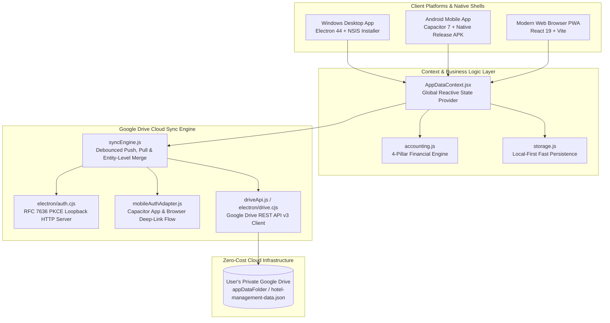
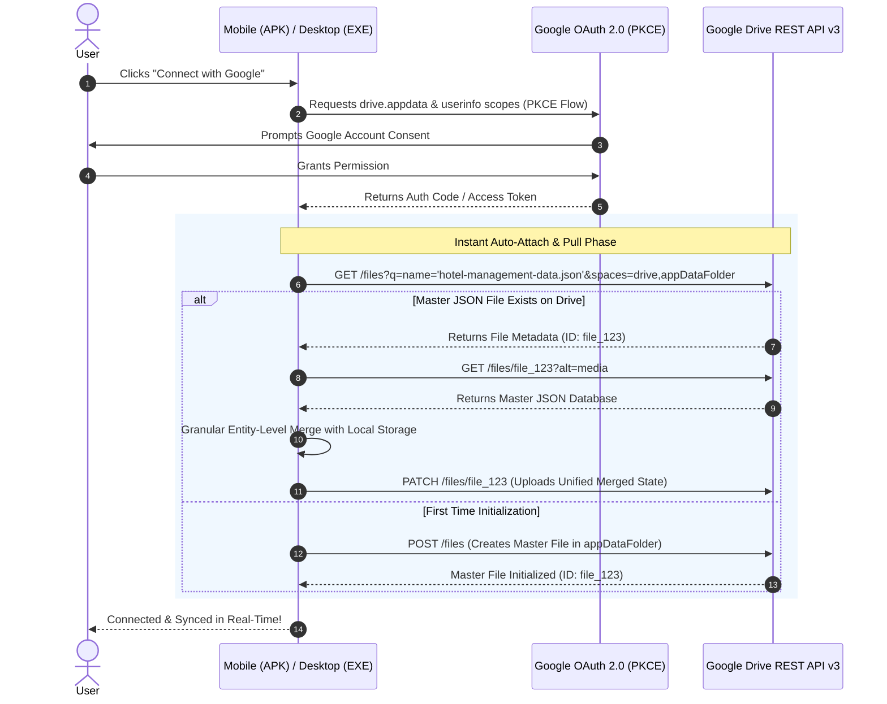

# 🏨 My Hotel & Restaurant Manager (5-Star Accounting & Management System)

[](file:///c:/Users/siamhasan/Desktop/My%20Hotel/package.json)
[]()
[]()
[]()
[]()
[]()
[]()

> **An enterprise-grade, offline-first accounting, sales ledger, partners/staff ledger, and real-time Google Drive synchronization system engineered specifically for hotels, restaurants, and hospitality businesses.**

---

## 📑 Table of Contents

1. [🌟 Key Highlights & Problem Solved](#-key-highlights--problem-solved)
2. [🏗️ System Architecture](#️-system-architecture)
3. [📊 4-Pillar Financial Engine & Accounting Formulas](#-4-pillar-financial-engine--accounting-formulas)
4. [☁️ Zero-Cost Google Drive Cloud Sync Architecture](#️-zero-cost-google-drive-cloud-sync-architecture)
5. [🖥️ Primary Application Screens](#️-primary-application-screens)
6. [🚀 Quick Start & Installation](#-quick-start--installation)
7. [📦 Production Build & Packaging](#-production-build--packaging)
8. [🔐 Google Cloud OAuth 2.0 Configuration](#-google-cloud-oauth-20-configuration)
9. [📁 Repository Structure](#-repository-structure)
10. [📄 Technical Manual](#-technical-manual)

---

## 🌟 Key Highlights & Problem Solved

Traditional accounting software (e.g. QuickBooks, Tally, or Excel spreadsheets) struggles with the fast-paced daily operational reality of hospitality businesses:
- **Morning Raw Market Volatility (কাঁচা বাজার):** Physical cash spent early morning for meat, fish, vegetables, and groceries.
- **Family Business Partner Withdrawals (মালিকদের পকেট খরচ / Drawings):** Multiple partners taking variable cash withdrawals directly from the cash drawer.
- **Daily Staff Salary Advances (কর্মচারীদের দৈনিক খোরাকি / অগ্রিম):** Continuous daily advances against monthly salaries.
- **End-of-Day Cash Drawer Reconciliation:** Verifying physical counter cash against calculated expected cash.
- **Zero Cloud Hosting Costs:** No expensive monthly database servers ($20–$50/month). The entire state is synced securely to the user's private Google Drive.

### 💎 Core Capabilities:
- **Offline-First Resilience:** Instant local CRUD operations that work without internet connection.
- **Single Master JSON Database:** Desktop and Mobile devices connect and sync to the exact same file (`hotel-management-data.json`) on Google Drive.
- **Instant Auto-Attach on Sign-In:** The moment you sign in with Google on any device, the system automatically discovers, attaches, and downloads the master cloud database.
- **Bidirectional Entity Merge:** Automatically reconciles cashier sales entered on Windows PC with manager market expenses entered on Android mobile.
- **Dual Platform Native Builds:** Windows Desktop Installer (`.exe` NSIS) and Android Mobile (`.apk` signed release).

---

## 🏗️ System Architecture



---

## 📊 4-Pillar Financial Engine & Accounting Formulas

The system implements rigorous mathematical accounting principles tailored for hotel and restaurant management:

### 1. Daily Gross Sales & Revenue
$$\text{Total Sales} = \text{Cash Sales} + \text{Digital Sales (bKash / Nagad / Cards)}$$

### 2. Daily Total Cash Outflow (Drawings + Advances + Bazar + Wastage)
$$\text{Total Cash Outflow} = \text{Morning Bazar} + \text{Partner Drawings} + \text{Staff Advances} + \text{Wastage/Demurrage}$$

### 3. Expected Counter Cash (Reconciliation Rule)
$$\text{Expected Counter Cash} = \text{Opening Float} + \text{Cash Sales} - \text{Total Cash Outflow}$$

### 4. Cash Drawer Variance (Surplus / Shortage)
$$\text{Cash Variance} = \text{Actual Night Physical Cash Count} - \text{Expected Counter Cash}$$
* If $\text{Variance} > 0$: **Cash Surplus (বাড়তি ক্যাশ)**
* If $\text{Variance} < 0$: **Cash Shortage (ঘাটতি ক্যাশ)**
* If $\text{Variance} = 0$: **Perfect Balanced Drawer (পারফেক্ট মিল)**

### 5. Daily Operational Profit
$$\text{Operating Profit} = \text{Total Sales} - \text{Morning Bazar} - \text{Wastage}$$

### 6. Monthly Net Profit (After Overhead)
$$\text{Net Profit} = \text{Total Monthly Operating Profit} - \text{Monthly Fixed Bills (Rent, Electric, Gas, Net)} - \text{Total Net Staff Salaries}$$

### 7. Staff Salary Balance
$$\text{Remaining Salary Payable} = \text{Base Monthly Salary} - \sum \text{Daily Staff Advances}$$

### 8. Partner Return on Investment (ROI)
$$\text{Partner Lifetime ROI (\%)} = \left( \frac{\sum \text{Partner Drawings}}{\text{Initial Capital Investment}} \right) \times 100$$

---

## ☁️ Zero-Cost Google Drive Cloud Sync Architecture

Instead of managing backend database servers, the app transforms Google Drive into a secure, free cloud database:



### Key Sync Subsystem Features:
1. **`drive.appdata` Scope:** Ensures mobile and PC access the exact same project application data directory without conflict.
2. **Debounced Background Sync (1.8s):** Prevents network spamming during rapid sales entry.
3. **Automatic Deduplication:** Cleans up older duplicates and always operates on the single newest master file ID.
4. **RFC 8252 Reverse DNS Deep-Linking:** Enables seamless Google authentication return on Android without web redirect loops.

---

## 🖥️ Primary Application Screens

| Screen | Key Features |
| :--- | :--- |
| **📈 Executive Dashboard** | Live Revenue, Net Profit, Breakeven Analysis, Top Expense Categories, Partner ROI, Quick Actions. |
| **📝 Daily Bazar & Sales Ledger** | Opening Float, Morning Market Bazar, Cash/Digital Sales, Partner Drawings, Staff Advances, Cash Count Reconciliation. |
| **👥 Partners & Staff** | Partner Equity & Drawings Tracker, Staff Salary, Daily Advances, Remaining Salary Slip Generator. |
| **🏢 CapEx Assets & Fixed Bills** | Fixed Hotel Assets (Kitchen appliances, AC, Furniture, Depreciation), Monthly Utilities (Rent, Electricity, Internet). |
| **☁️ Cloud & Backup Settings** | Google OAuth Configuration, Manual Push/Pull Trigger, Cloud Connection Telemetry, JSON Import/Export. |

---

## 🚀 Quick Start & Installation

### Prerequisites
- [Node.js](https://nodejs.org/) (v18.x or higher)
- [Git](https://git-scm.com/)
- [Android Studio](https://developer.android.com/studio) (for Android native builds)

### 1. Clone & Install
```bash
git clone https://github.com/siiiiamhasan/My-Hotel-.git
cd My-Hotel-
npm install
```

### 2. Run in Development Mode
```bash
# Run Web Application in Browser
npm run dev

# Run Windows Desktop App with Electron Hot-Reload
npm run electron:dev
```

---

## 📦 Production Build & Packaging

### 💻 Build Windows Desktop Installer (`.exe`)
```bash
npm run electron:build
```
* Generates a 64-bit NSIS Setup Installer located in `dist_electron/My Hotel Manager Setup 1.1.0.exe`.

### 📱 Build Android Signed Release APK (`.apk`)
```bash
# 1. Build web bundle & sync with Capacitor
npm run build
npm run cap:sync

# 2. Build Release APK via Gradle
cd android
./gradlew assembleRelease
cd ..
```
* Generates the production signed APK located in `android/app/build/outputs/apk/release/app-release.apk`.

---

## 🔐 Google Cloud OAuth 2.0 Configuration

To enable Google Drive Cloud Sync with your own Google Cloud credentials:

1. Open [Google Cloud Console](https://console.cloud.google.com/).
2. Create a new project: `My Hotel Manager`.
3. Enable **Google Drive API** in APIs & Services.
4. In **OAuth Consent Screen**:
   - Set user type to **External**.
   - Add scopes:
     - `https://www.googleapis.com/auth/drive.appdata`
     - `https://www.googleapis.com/auth/drive.file`
     - `https://www.googleapis.com/auth/userinfo.email`
     - `https://www.googleapis.com/auth/userinfo.profile`
   - Add your Google account as a **Test User**.
5. Create OAuth 2.0 Client ID:
   - Application Type: **Desktop App** (Installed Application).
   - Name: `Hotel Desktop & Mobile Client`.
6. Copy `config/google-config.example.json` to `config/google-config.json` and insert your `clientId` and `clientSecret`.

---

## 📁 Repository Structure

```
My Hotel/
├── android/                        # Android Native Project (Capacitor)
│   ├── app/src/main/AndroidManifest.xml
│   └── app/build.gradle            # Release Signing Configurations
├── config/                         # Google OAuth Configuration
│   └── google-config.example.json
├── electron/                       # Windows Desktop Shell (Electron)
│   ├── main.cjs                    # Electron Main Process & IPC Handlers
│   ├── auth.cjs                    # RFC 7636 PKCE Loopback Server
│   ├── drive.cjs                   # Desktop Google Drive API Client
│   ├── store.cjs                   # SafeStorage Credentials Persistence
│   └── preload.cjs                 # Secure Context Bridge
├── public/                         # Public Assets & App Icons
│   └── App_logo.png                # Official Hotel & Restaurant Brand Logo
├── src/                            # Frontend Source (React 19 + Vite)
│   ├── context/
│   │   └── AppDataContext.jsx      # Global Reactive State Provider
│   ├── desktop/                    # Desktop-Optimized UI Layouts
│   │   ├── DesktopApp.jsx
│   │   ├── components/
│   │   └── screens/
│   ├── mobile/                     # Mobile-Optimized Touch UI Layouts
│   │   ├── MobileApp.jsx
│   │   ├── components/
│   │   └── screens/
│   ├── sync/                       # Unified Cloud Synchronization Engine
│   │   ├── syncEngine.js           # Push, Pull, Auto-Attach & Entity Merge
│   │   ├── driveApi.js             # Google Drive REST API v3 Services
│   │   ├── types.js                # Sync Status Constants & Scopes
│   │   └── adapters/
│   │       ├── desktopAuthAdapter.js
│   │       └── mobileAuthAdapter.js
│   ├── utils/
│   │   ├── accounting.js           # 4-Pillar Financial Engine
│   │   └── storage.js              # LocalStorage & Capacitor Storage Driver
│   └── theme/
│       └── colors.js               # Tailored 5-Star Design Tokens
├── capacitor.config.json           # Mobile Configuration
├── DOCUMENTATION.md                # Exhaustive Technical & Operational Manual
├── package.json
└── vite.config.js
```

---

## 📄 Technical Manual

For an exhaustive 700+ line technical breakdown including exact data schemas, cashier walkthroughs, and error recovery protocols, consult [`DOCUMENTATION.md`](file:///c:/Users/siamhasan/Desktop/My%20Hotel/DOCUMENTATION.md).

---

## ⚖️ License

Distributed under the **MIT License**. See `LICENSE` for more information.

**Developed with ❤️ for Hospitality & Restaurant Businesses.**
